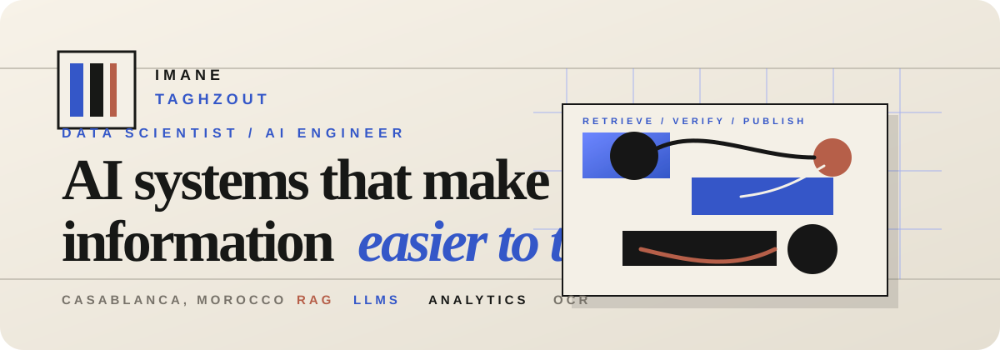
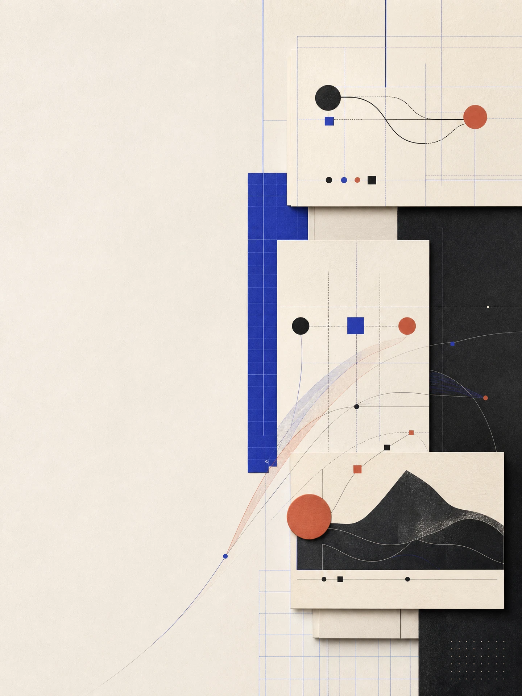
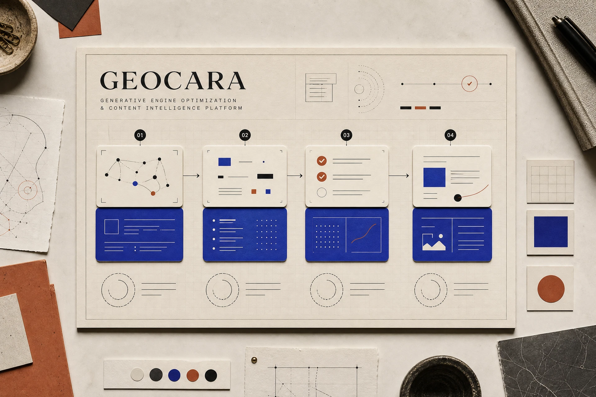
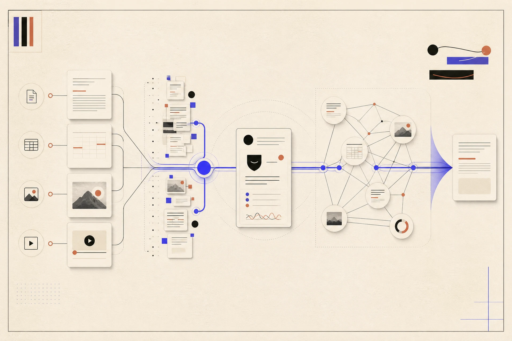
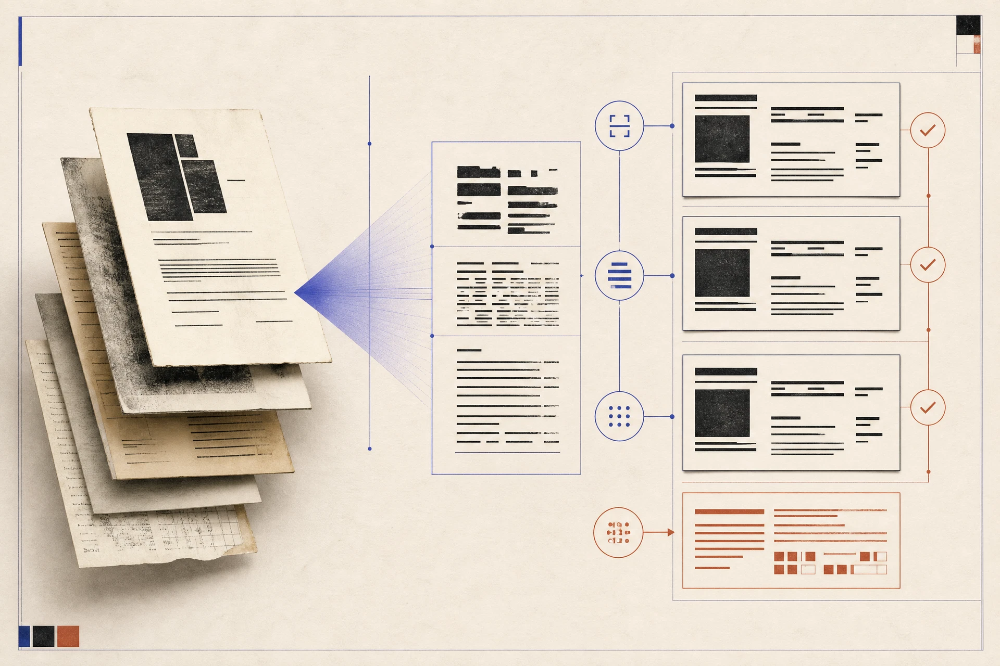

<div align="center">

# AI Systems, Made Legible

**Imane Taghzout** · Data Scientist and AI Engineer

Retrieval, analytics, and production minded AI systems built around clarity, evidence, and useful decisions.

[Live Portfolio](https://imanetag.github.io/) · [CV PDF](https://imanetag.github.io/Imane_Taghzout_CV_FR_EN.pdf) · [GitHub](https://github.com/imane-tag) · [LinkedIn](https://linkedin.com/in/imane-taghzout)

</div> <p align="center">

</p>

## Why this portfolio exists

This repository contains the source for Imane Taghzout’s personal portfolio. It presents applied artificial intelligence, retrieval systems, analytics work, and production minded data science projects through evidence, context, measurable outcomes, and the decisions behind the work.

The portfolio is intentionally designed as a field notebook rather than a generic project gallery. Each project is introduced through its setting, role, methods, tools, and result so visitors can understand not only what was built, but why it mattered.

## Selected work

<p align="center">

</p> <p align="center">
  
  
  
</p>

The individual project visuals are also included in this repository for reuse:

| Project | Context | Evidence | Image |
| --- | --- | --- | --- |
| **GEOCARA** | Generative Engine Optimization and content intelligence platform | Six GEO metrics evaluated across fifty page crawls | [View image](assets/geocara-project.png) |
| **Enterprise RAG** | Multimodal retrieval for internal documentation | Research time reduced from five minutes to twenty seconds | [View image](assets/enterprise-rag-project.png) |
| **Document Intelligence** | OCR and NLP workflow automation | Processing throughput improved by thirty percent | [View image](assets/document-intelligence-project.png) |

These projects represent different parts of the same working approach: make complex information easier to retrieve, verify, explain, and act on.

## What you will find in the portfolio

| Chapter | Focus |
| --- | --- |
| **Selected Projects** | Applied projects with roles, technologies, context, and outcomes |
| **GEOCARA Case Study** | A deeper audit, enrichment, verification, and publication workflow |
| **Experience** | Internship work across AI engineering, data engineering, analytics, and automation |
| **Capabilities** | LLM systems, RAG, NLP, analytics, production tooling, and working methods |
| **About** | Background, motivation, and the person behind the technical work |
| **Field Notes** | Short principles about clarity, evidence, and responsible system building |
| **Credentials** | Education, certifications, languages, and interests |

## Tech Palette

<p align="center">

</p> <p align="center">
  <sub>AI systems · retrieval · analytics · business intelligence · production tooling</sub>
</p>

| Area | Tools and methods |
| --- | --- |
| **AI systems** | LLMs, RAG, prompt workflows, evaluation, and content intelligence |
| **Data practice** | Python, SQL, statistics, forecasting, exploratory analysis, and KPI design |
| **Business intelligence** | Power BI, SPSS, Excel, reporting, and decision support |
| **Document systems** | OCR, NLP, extraction, verification, and structured publishing |
| **Production tooling** | React, TypeScript, Vite, Tailwind CSS, Docker, FastAPI, Git, and GitHub |

## Visual language

The portfolio uses a warm editorial system built around paper toned neutrals, cobalt blue, charcoal ink, and restrained terracotta accents. The visual language is intended to make technical work feel precise without becoming cold, and personal without becoming informal.

The main header preserves the exact identity text, while the uploaded PNG assets provide the hero and project visuals below it. The additional PNG project visuals are artwork assets only, while project names, roles, dates, and metrics remain real Markdown or HTML text wherever they appear.

## Run locally

Install the project dependencies:

```bash
pnpm install
```

Start the development server:

```bash
pnpm run dev
```

Run the project checks:

```bash
pnpm run check
```

Build the production version:

```bash
pnpm run build
```

## Project links

| Destination | Link |
| --- | --- |
| Portfolio | [imanetag.github.io](https://imanetag.github.io/) |
| CV PDF | [Download the CV](https://imanetag.github.io/Imane_Taghzout_CV_FR_EN.pdf) |
| GitHub | [github.com/imane-tag](https://github.com/imane-tag) |
| LinkedIn | [linkedin.com/in/imane-taghzout](https://linkedin.com/in/imane-taghzout) |
| Email | [taghzoutimane@gmail.com](mailto:taghzoutimane@gmail.com) |

## Repository structure

```
assets/
  readme-header.svg
  readme-project-strip.svg
  hero-systems-thinking.png
  geocara-project.png
  enterprise-rag-project.png
  document-intelligence-project.png

client/
  src/
    pages/        Page level portfolio sections
    components/   Reusable interface components
    contexts/     Theme and shared application context
    hooks/        Reusable interaction hooks
    index.css     Editorial design system and theme rules

server/           Development compatibility server
shared/           Shared project constants
```

## Closing note

Built with intent in Casablanca. Designed around clarity, trust, and useful systems.

<div align="center">

**Data Scientist and AI Engineer · Applied AI · Analytics · Retrieval · Production Systems**

</div>
