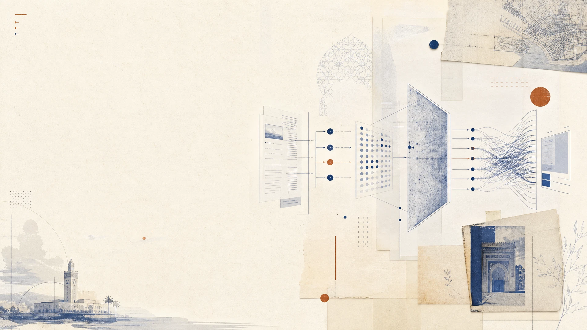

# Imane Taghzout Portfolio

<p align="center">
  
</p>

<p align="center">
  <a href="https://imanetag.github.io/">
    
  </a>
  <a href="https://imanetag.github.io/Imane_Taghzout_CV_FR_EN.pdf">
    
  </a>
  <a href="mailto:taghzoutimane@gmail.com">
    
  </a>
</p>

<h3 align="center">Data Scientist & AI Engineer building AI systems that make information easier to trust and act on.</h3>

---

## What This Is

This is the source for my personal portfolio: a warm editorial website for presenting applied AI, retrieval systems, analytics work, and production-minded data science projects.

The site is built to feel less like a template and more like a field notebook: evidence, project context, measurable impact, and the person behind the work.

## Featured Work

| Project | Focus | Signal |
| --- | --- | --- |
| **GEOCARA** | Generative Engine Optimization platform | 6 GEO metrics across 50 page crawls |
| **Enterprise RAG** | Multimodal retrieval for internal documentation | Research time from 5 min to 20 s |
| **Document Intelligence** | OCR and NLP workflow automation | +30% processing throughput |

## Portfolio Sections

| Section | What You Will Find |
| --- | --- |
| **Selected Projects** | Case-style project summaries with roles, stack, and outcomes |
| **GEOCARA Case Study** | Deeper breakdown of the audit-to-publication pipeline |
| **Experience** | Applied AI, data engineering, and systems timeline |
| **Capabilities** | LLMs, RAG, NLP, analytics, production tooling, and working style |
| **Credentials** | Education, certifications, languages, and interests |

## Tech Palette

<p>
  
  
  
  
  
  
</p>

## Run Locally

```bash
pnpm install
pnpm run dev
```

Build for production:

```bash
pnpm run check
pnpm run build
```

## Links

- Portfolio: https://imanetag.github.io/
- CV PDF: https://imanetag.github.io/Imane_Taghzout_CV_FR_EN.pdf
- GitHub: https://github.com/imane-tag
- LinkedIn: https://linkedin.com/in/imane-taghzout
- Email: taghzoutimane@gmail.com

---

<p align="center">
  Built with intent in Casablanca. Designed around clarity, trust, and useful systems.
</p>
